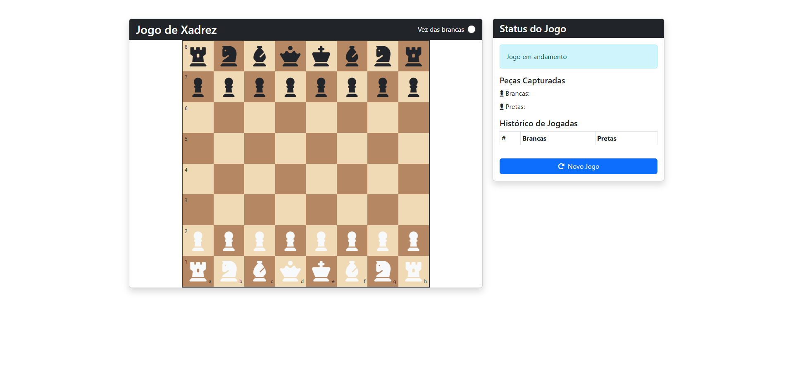

# Jogo de Xadrez

## 📝 Descrição

Este é um jogo de xadrez completo desenvolvido com HTML, CSS e JavaScript puro. O jogo implementa todas as regras oficiais do xadrez, incluindo movimentos especiais como roque, en passant e promoção de peões.



## 🎮 Como Jogar

1. Acesse o jogo em [https://gabecmelo.github.io/chess-game](https://gabecmelo.github.io/chess-game)
2. Clique em uma peça para selecioná-la
3. Os movimentos válidos serão destacados no tabuleiro
4. Clique em uma das casas destacadas para mover a peça
5. O jogo alterna automaticamente entre os jogadores (brancas e pretas)
6. Use o botão "Novo Jogo" para reiniciar a partida a qualquer momento

## ♟️ Funcionalidades

- **Interface Intuitiva**: Tabuleiro e peças visualmente claros com destaque para movimentos válidos
- **Regras Completas**: Implementação de todas as regras oficiais do xadrez:
  - Movimentos básicos de todas as peças
  - Roque (curto e longo)
  - Captura en passant
  - Promoção de peões com escolha da peça
  - Detecção de xeque, xeque-mate e empate por afogamento
- **Histórico de Jogadas**: Registro das jogadas em notação algébrica
- **Peças Capturadas**: Exibição das peças capturadas por cada jogador
- **Indicador de Turno**: Mostra claramente de qual jogador é a vez
- **Design Responsivo**: Adaptável a diferentes tamanhos de tela

## 🔄 Movimentos Especiais

### Promoção de Peões
Quando um peão alcança a última fileira do tabuleiro adversário, um modal é exibido permitindo que você escolha entre quatro peças para promoção:
- Rainha
- Torre
- Bispo
- Cavalo

### Roque
Para realizar o roque, selecione o rei e clique na casa duas casas à direita (roque curto) ou duas casas à esquerda (roque longo). O movimento só é possível se:
- Nem o rei nem a torre envolvida foram movidos anteriormente
- Não há peças entre o rei e a torre
- O rei não está em xeque
- O rei não passa por casas atacadas durante o movimento

### En Passant
A captura en passant pode ser realizada quando um peão adversário avança duas casas a partir de sua posição inicial e para ao lado do seu peão. Você pode capturá-lo como se ele tivesse avançado apenas uma casa.

## 💻 Tecnologias Utilizadas

- HTML5
- CSS3
- JavaScript (ES6+)
- Bootstrap

## 🧠 Algoritmos Implementados

- Cálculo de movimentos válidos para cada tipo de peça
- Detecção de xeque e xeque-mate
- Verificação de movimentos que deixariam o próprio rei em xeque
- Lógica para movimentos especiais (roque, en passant, promoção)

## 🚀 Como Executar Localmente

1. Clone o repositório:
    ```bash
    git clone [https://github.com/gabecmelo/chess-game.git](https://github.com/ gabecmelo/chess-game.git)
2. Navegue até o diretório do projeto:
    ```bash
    cd chess-game
3. Abra o arquivo `index.html` em seu navegador preferido

## 📋 Próximos Passos

- [ ] Implementar sistema de temporizador para partidas com tempo
- [ ] Adicionar opção para jogar contra IA
- [ ] Salvar partidas para continuar posteriormente

## 📄 Licença

Este projeto está licenciado sob a licença MIT - veja o arquivo LICENSE para mais detalhes.

## 👨‍💻 Autor

Desenvolvido por [Gabriel Melo](https://github.com/gabecmelo)

---

### Divirta-se jogando xadrez! ♟️